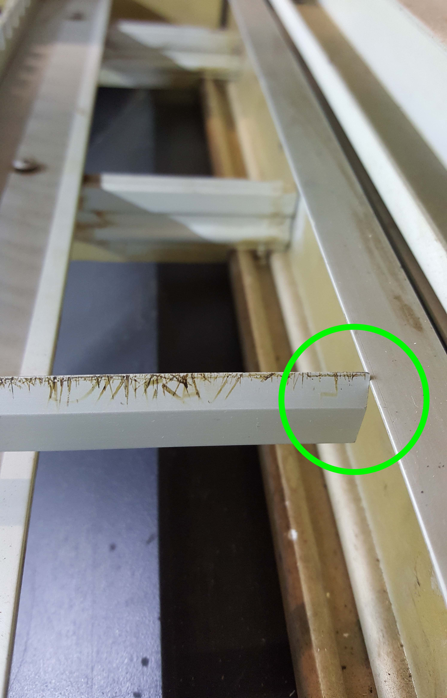
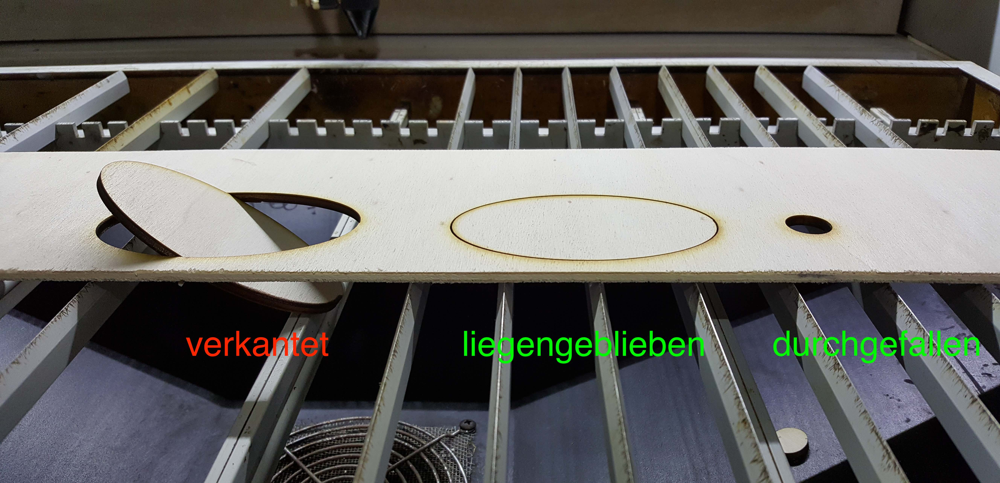
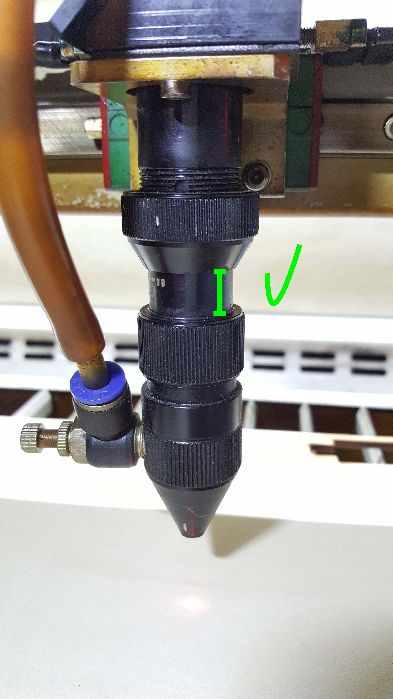
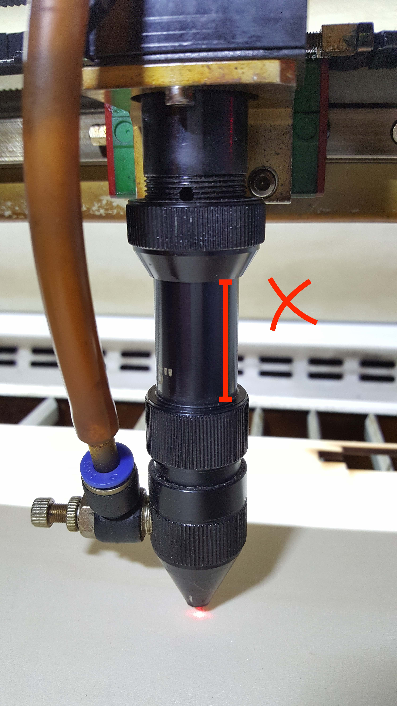
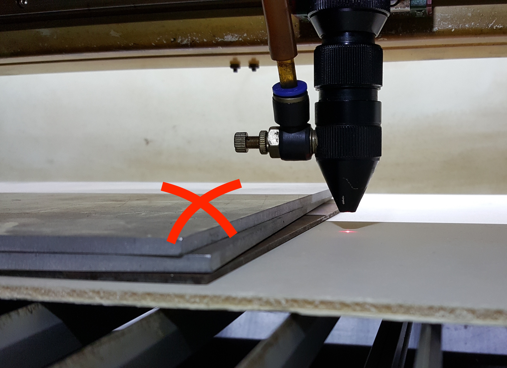

# Arbeit am Laser beginnen

!!! warning "Sicherheit"
    Bevor es losgeht, stelle sicher dass der CO2-Löscher, der Brandeimer und die Zange (zum Greifen von Werkstücken) in der Nähe sind.
    
    (BILD)

    Verwende nur erlaubte [Materialien zum Lasern](nachschlagen_materialliste.md).

## Geräte einschalten

!!! info "Geräte einschalten"
    Es ist egal, in welcher Reihenfolge die Geräte eingeschaltet werden (auch der PC).

### Laser

Zum Einschalten des Lasers müssen die folgenden Schritte durchgeführt werden:

1. Schubladen-Schlüssel aus der Schlüsselbox holen
2. Schublade am Laser öffnen, um an den Geräteschlüssel zu gelangen
3. Gerät mit Geräteschlüssel einschalten
4. Abwarten bis der Laserkopf sich vollständig ausgerichtet hat

=== "Schlüsselbox"

    

=== "Chiller, Stäbe & Wabenplatte"

    

=== "Lüftung"

    

### Kühlung

Die Kühlung schaltest du am Kippschalter an. Es macht kurz laute Piep-Geräusche.

### Lüftung

Die Lüftung schaltest du am grünen Schalter am Metallgitter an.

Die Lüftung ist ziemlich laut, du kannst sie daher auch erst dann anschalten bevor du tatsächlich loslaserst. Dann aber nicht vergessen.

 

## Lasern vorbereiten

### Laserklappe

Öffne die Klappe immer mit beiden Händen damit sie sich nicht verzieht.

### Stäbe einsetzen

Die Stäbe dienen als Auflagefläche für dein Werkstück.

Setze die Stäbe mit der spitzen Seite nach oben in ihre Führungen ein. Die Stäbe liegen locker in den Führungen. Nicht mit Gewalt runterdrücken! Wenn es hakt, steckt der Stab wahrscheinlich vorne oder hinten unter dem Rahmen.

|    |   |
| ---------------------------------------- | :------------------------------------: |
| 
Richtig
        | 
Stab steckt unter dem Rahmen
   |

Achte darauf, dass das Stück, das ausgelasert wird, auf den Stäben liegenbleibt. Sollte es rausfallen, darf es nicht verkanten, da sonst der Laserkopf dagegen stoßen kann. Ganz kleine Stücke dürfen zwischen den Stäben durchfallen.

 

### Fokus einstellen

Leg dein Werkstück auf die Stäbe, unter den Laserkopf. Wenn die Arbeitsfläche sehr weit oben oder unten ist, fahre die Arbeitsfläche entsprechend ein Stück runter oder hoch (Z-Achse). Der Schalter für die Z-Achse befindet sich an der rechten Seite des Lasers.

Achtung: Fahre dabei nie mit der Arbeitsfläche bis an den Laserkopf ran!

Den Laserkopf kannst du mit den grünen Pfeiltasten am Laser in X- und Y-Richtung bewegen (genaueres zu allen Tasten siehe ...)

Leg die Fokus-Scheibe auf das Werkstück, sodass sie zwischen Werkstück und Laserkopf ist.

Drehe die obere Windung des Laserkopfes auf. Schiebe den Schaft nach unten, bis er auf der Fokus-Scheibe aufsetzt. Drehe die Windung handfest zu. Nicht so festballern, dass es keiner mehr auf kriegt. Ziehe nun die Fokusscheibe raus.

!!! info
    Die Fokusscheibe ist 7 mm dick. Dieser Abstand sorgt für optimalen Laserfokus auf der Materialoberfläche.

Häufiger Fehler: der Schaft des Laserkopfes ist viel zu weit rausgezogen. Ziehe ihn beim Fokus-einstellen nicht noch weiter raus. Schiebe den Schaft zunächst ganz nach oben und drehe ihn erstmal wieder zu. Fahre dann die Arbeitsfläche höher (Z-Achse). Stelle dann den Fokus mithilfe der Scheibe ein.

|    |   |
| ---------------------------------------- | :------------------------------------: |
| 
Richtig
        | 
Schaft zu weit raus
   |

Achte beim zudrehen darauf, dass das Ventil nach links oder hinten zeigt. Das ist wichtig, da es in den anderen Richtungen gegen die Wände fahren würde. Auch wenn du nicht vorhast, die ganze Fläche zu verwenden, es kann immer aus Versehen passieren, dass man mit dem Laserkopf an die Ränder fährt.

(Video: Fokus einstellen)

!!! info "Bei Bedarf: Werkstück beschweren"
    Wenn das Werkstück leicht gebogen ist, kann es mit Metallplatten beschwert werden. Nach Möglichkeit kein stark gebogenes Werkstück lasern.
    Die Metallplatten dürfen nicht höher sein als der Abstand zwischen Werkstück und Laserkopf.

    |    |   |
    | ---------------------------------------- | :------------------------------------: |
    | 
Richtig
        | 
Platten zu hoch gestapelt
   |

