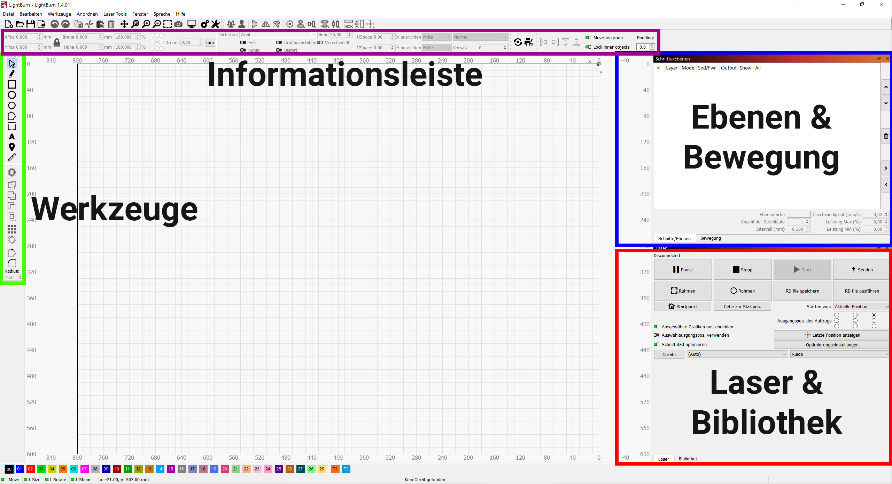

# Einführung in Lightburn
Auf dem folgenden Bild siehst Du eine grundlegende Übersicht zu Lightburn:

Auf der rechten Seiten verschiedenen sich verschiedene Bedienfelder in derselben Fläche. Du kannst über die Tabs zwischen den Bedienfeldern wechseln.

=== "Werkzeuge"

    Hier findest Du verschiedene Werkzeuge für den Umgang mit der Arbeitsfläche:

    - Grundlegende Formen
    - Text
    - Positionswerkzeug, um den Laserkopf an eine bestimmte Stelle zu bewegen
    - Boolsche Operationen (Formen zusammenfügen/ trennen/ etc.)
    - Array-Werkzeuge, um ein Schnittmuster automatisch zu vervielfältigen
    - Bearbeitungswerkzeuge für Punkte/ Ecken

=== "Ebenen"

    Schnittmuster können auf mehrere Ebenen verteilt werden. So kannst Du bequem unterschiedliche Teile deines Schnittmusters mit unterschiedlichen Einstellungen lasern.

    Bei den Ebenen wird die Art des Laserns (Schneiden/ Gravur) sowie die Laserstärke eingestellt. Bei Bedarf auch andere Einstellungen (z.B. Anzahl der Durchgänge, Versatz).

=== "Bewegung"

    Hier kann der Laserkopf manuell gesteuert. Dabei kann die Geschwindigkeit und die Schrittweite eingestellt werden.

    Je nach persönlicher Arbeitsweise ersetzt oder ergänzt dieses Bedienfeld die Steuerung direkt am Gerät.

=== "Laser"

    Hier erfolgt die Steuerung des Laservorgangs (Start, Stop, Pause). Du kannst auswählen

=== "Bibliothek"

    In der Materialbibliothek

